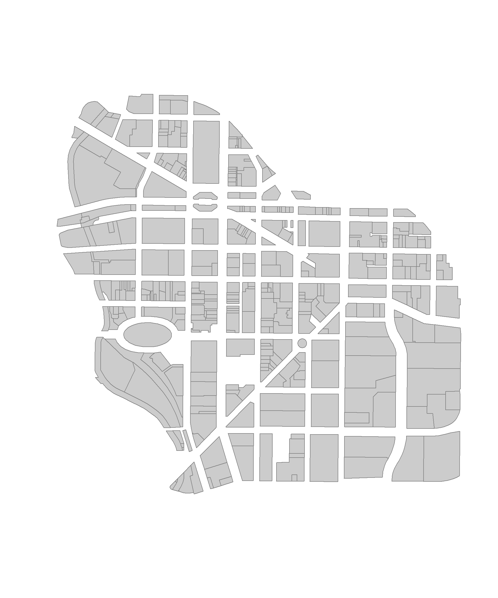
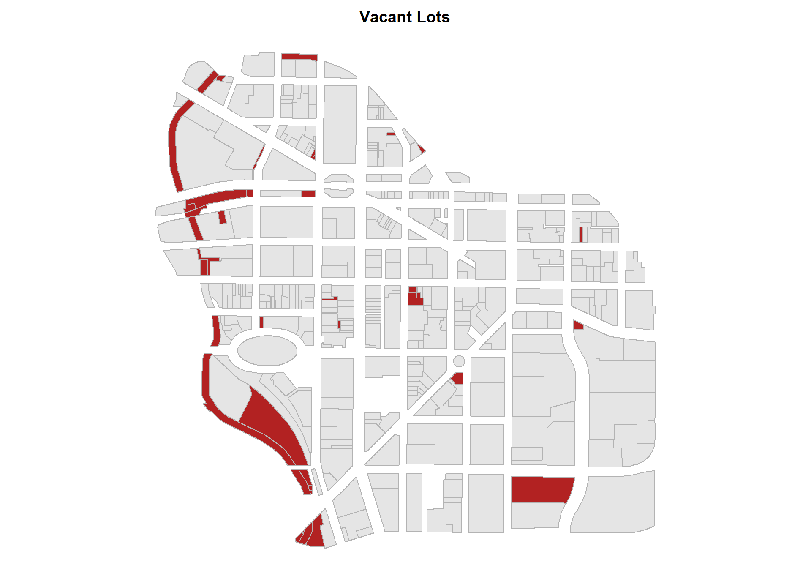
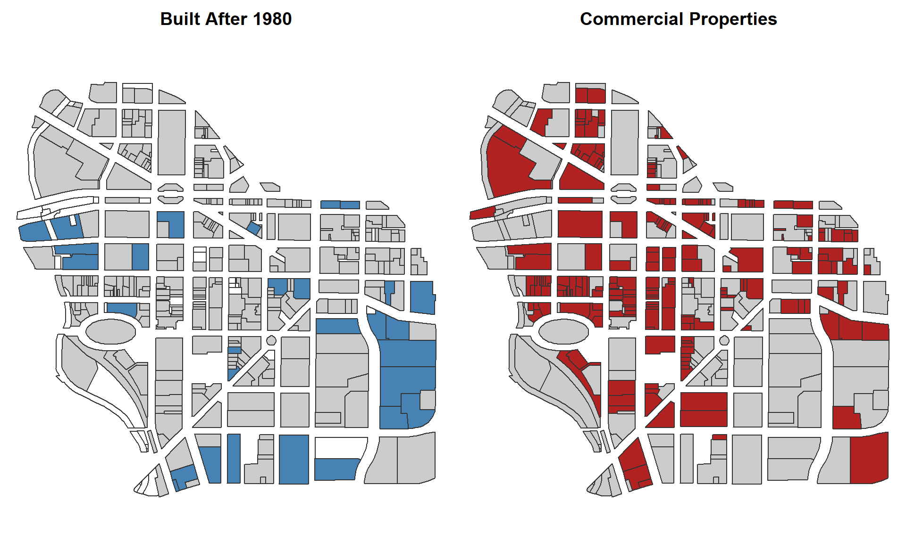
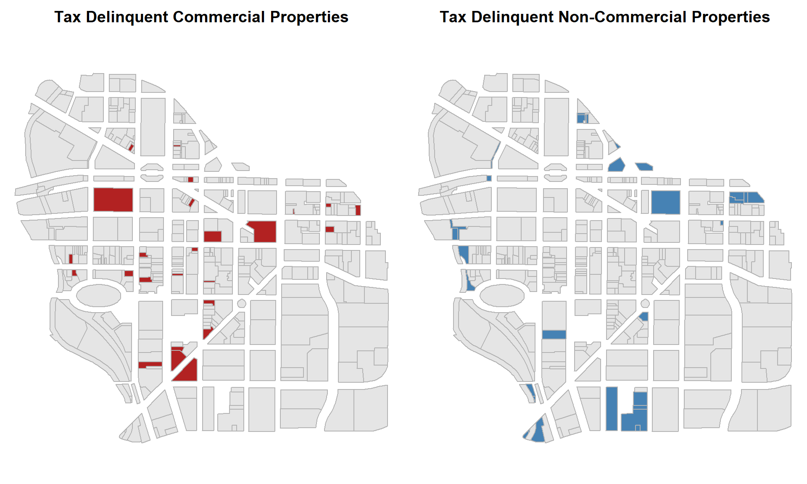
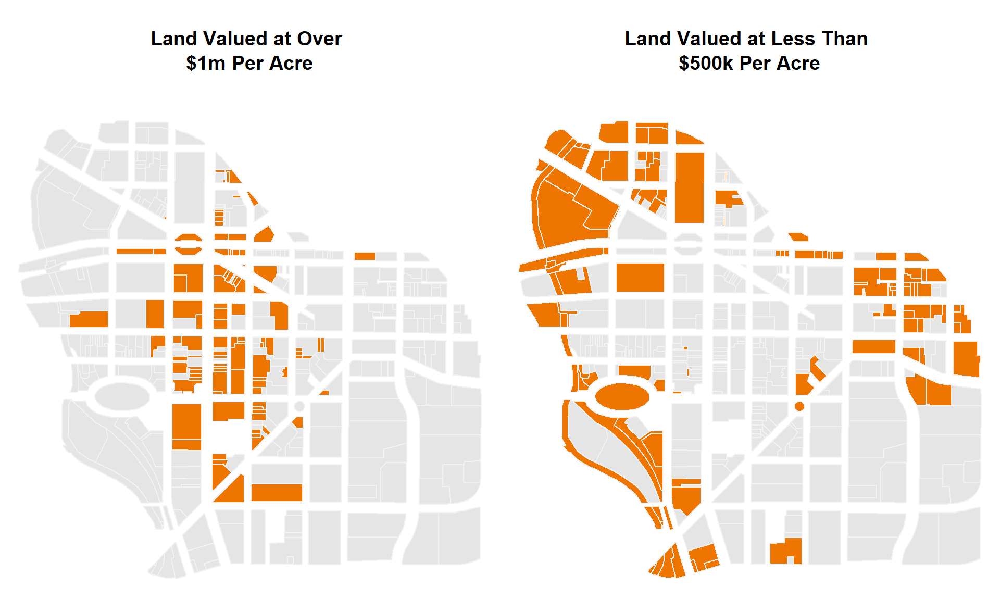
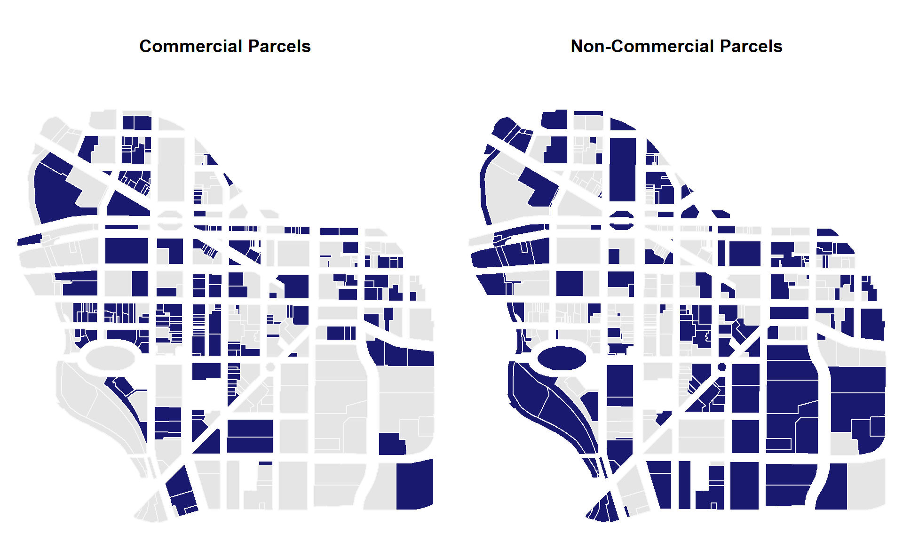
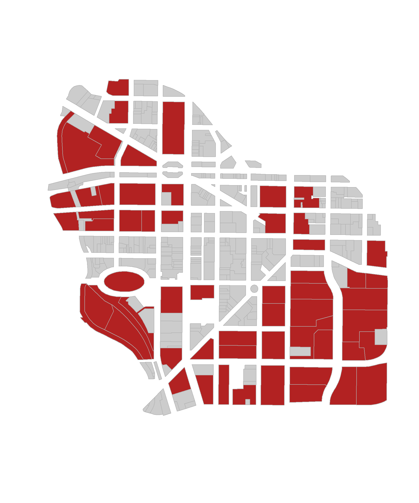

#### [CPP 526: Foundations of Data Science I](https://ds4ps.org/cpp-526-spr-2020/)

<br>


---

<br>

#### This lab offers practice with logical statements used to create groups from your data.


I have provided you with a **LAB-02 RMD template**: 


[](https://www.dropbox.com/s/tmiqepil1u05e1q/Lab-02-LastName%20.Rmd?dl=1)


--- 

<br><br>

# Getting Started 


## Functions Used in this Lab

You will use the following functions for this lab: 


```r
logical operators  ( ==, >, <, ! )
sum()        # count TRUEs in logical vectors
mean()       # proportion of TRUEs in logical vectors
compound statements with & (AND) and | (OR) operators 
```


<br><br>


## Data

This lab uses **city tax parcel data** from Syracuse, NY. 

* Each house, business, park or empty lot in the city sits on a parcel of land, and the tax rate for that parcel is determined by the city. 
* All of the characteristics of each parcel is stored in a central database, along with information about the land use classifications, owners, and whether the property is up-to-date on taxes and water bills.  
* Each row represents one tax parcel, and all tax parcels in the city are recorded in the dataset.  


We will use the downtown area for this lab:


<br>
<br>


#### Load the Downtown Syracuse Parcel Map

You will need the following packages for this lab:


```r
install.packages( "geojsonio" )
install.packages( "sp" )
install.packages( "rgdal" )
```

NOTE: do not include include install package commands in your RMD chunks. Trying to install packages while knitting can cause errors. 


```r
library( geojsonio )
library( sp )
library( rgdal )
```

Load the map file:


```r
URL <- "https://raw.githubusercontent.com/DS4PS/Data-Science-Class/master/DATA/downtown-syr.geojson"
downtown <- geojson_read( URL, what="sp" )
plot( downtown,  border="gray50", col="gray80" )
```




<br>

-----

<br>


#### [Data Dictionary](https://ds4ps.github.io/Data-Science-Class/DATA/syr_parcels.html)

*Note, the downtown file contains a subset of the fields.*


-----------------------------------------------------------------------------
  &nbsp;               tax_id             stnum             stname           
----------- ---------------------------- -------- ---------------------------
 **15584**   31150010100000100080010000   484-98   SALINA ST S & ONONDAGA ST 

 **15604**   31150010300000150050000000   311-17   WATER ST E TO ERIE BLVD E 

 **15607**   31150010300000160010000000    257     WATER ST E & MONTGOMERY S 

 **15611**   31150010300000160020000000    251     WATER ST E TO ERIE BLVD E 

 **15613**   31150010300000160030000000   243-49   WATER ST E TO ERIE BLVD E 

 **15615**   31150010300000160040000000    239     WATER ST E TO ERIE BLVD E 

 **15616**   31150010300000160050000000    235     WATER ST E TO ERIE BLVD E 

 **15618**   31150010300000160060000000   207-33   WATER ST E TO ERIE BLVD E 

 **15619**   31150010300000160070000000    203     WATER ST E & WARREN ST S  

 **15625**   31150010400000170010000000    135     WATER ST E & WARREN ST S  
-----------------------------------------------------------------------------

Table: Table continues below

 
---------------------------------------------------------------------------
  &nbsp;      zip    frontfeet   depth   sqft     acres     nhood     ward 
----------- ------- ----------- ------- ------- --------- ---------- ------
 **15584**   13078     143.7     273.2   57935    1.33     Downtown    09  

 **15604**   13202     79.09     78.71   6209    0.1425    Downtown    15  

 **15607**   13202      41        60     2475    0.05681   Downtown    09  

 **15611**   14534     40.89      60     2467    0.05662   Downtown    09  

 **15613**   13066     41.63      60     2499    0.05738   Downtown    09  

 **15615**   13088     20.81      60     1244    0.02856   Downtown    09  

 **15616**   13202     20.81      60     1248    0.02865   Downtown    09  

 **15618**   13202     136.9      60     8169    0.1875    Downtown    09  

 **15619**   13202     28.26      59     1694    0.03889   Downtown    09  

 **15625**   13088     57.3      59.44   3390    0.07783   Downtown    09  
---------------------------------------------------------------------------

Table: Table continues below

 
------------------------------------------------------------------------
  &nbsp;     censustract    landuse     yearbuilt   units   vacantbuild 
----------- ------------- ------------ ----------- ------- -------------
 **15584**       32         Parking         0         0         NA      

 **15604**       32        Commercial     1950        0          N      

 **15607**       32          Parks          0         0          N      

 **15611**       32        Commercial     1900        0          N      

 **15613**       32        Commercial     1950        0          N      

 **15615**       32        Commercial     1950        0          N      

 **15616**       32        Commercial     1980        0          N      

 **15618**       32        Commercial     1980        0          N      

 **15619**       32        Commercial     1940        0          N      

 **15625**       32        Commercial     1887        0          N      
------------------------------------------------------------------------

Table: Table continues below

 
--------------------------------------------------------------------------
  &nbsp;     watersvc   assessedland   assessedval   citytaxable   starc  
----------- ---------- -------------- ------------- ------------- --------
 **15584**      NA         650000        650000        650000      650000 

 **15604**      A          61600         112000           0          0    

 **15607**      NA         24600          24600           0          0    

 **15611**      A          24000         211000        211000      211000 

 **15613**      A          24600         384000        384000      384000 

 **15615**      A          24000         160000        160000      160000 

 **15616**      A          24000         166000        166000      166000 

 **15618**      A          104400        225000        225000      225000 

 **15619**      A          33000         396000        205000      205000 

 **15625**      A          100900         3e+05         3e+05      3e+05  
--------------------------------------------------------------------------

Table: Table continues below

 
---------------------------------------------------------------------------
  &nbsp;     taxtrust   amtdelinqt   taxyrsdelinqt   overduewater   totint 
----------- ---------- ------------ --------------- -------------- --------
 **15584**      NA          0              0              0           0    

 **15604**      NA          0              0              0           0    

 **15607**      NA          0              0              0           0    

 **15611**      NA          0              0              0           0    

 **15613**      NA          0              0              0           0    

 **15615**      NA          0              0            45.64         0    

 **15616**      NA          0              0             2.13         0    

 **15618**      NA          0              0             2.41         0    

 **15619**      NA          0              0            323.9         0    

 **15625**      NA          0              0              0           0    
---------------------------------------------------------------------------


<br>

-----------

<br>


<br><br>

# Lab Instructions


Answer the following questions using the Syracuse downtown parcels dataset and the functions listed. 

Your solution should include a written response to the question, as well as the code used to generate the result.

The images are included so that you can check whether your logical statements are correct. 

--- 

<br>

## Questions 


#### 1. Where are the majority of vacant lots located in the downtown? Produce a map of your results that matches the one shown here. 

> **land_use** variable 



<br>

#### 2. How many parking lots are in downtown Syracuse? Map your results. 

> **sum()** function and **landuse** variable 


<br>


<br>


#### 3. Where is new construction located in the city? 

**Calculate the number of buildings constructed since 1980.**

> **yearbuilt** variable




**What proportion of commercial properties are built since 1980?**

> count commercial properties, and buildings constructed since 1980: 
> **landuse** and **yearbuilt** variables 


<br>

 
#### 4. How many parcels have assessed values over $10 million? Map your results. 

> use the **sum()** function with **assessedval** variable;  


<br>


    
#### 5. How many properties are delinquent on taxes? Map your results. 

> **sum()** with the **amtdelinqt**;


<br>

    
#### 6. What proportion of parcels have delinquent tax payments owed? 

> **mean()** with the **amtdelinqt** variable


<br>


#### 7. What proportion of commercial properties are delinquent on taxes? What proportion of delinquent tax bills are owed by commercial parcels? 

> **mean()** with **amtdelinqt** and **landuse** variables
> define your groups with compound statements first
> then calculate proportions 




<br>


#### 8. How many of each land use type are delinquent on taxes? 

> **table()** with **amtdelinqt** and **landuse** variables
> define delinquency first, then create a table with
> landuse and delinquency


<br>
<br>


---

## Challenge Questions

**Map all of the land valued at over $1 million per acre.**

**Map all of the land valued at less than $500,000 per acre.**





**What is the total value of all of the commercial parcels in the city?**

**What is the total value of all of the non-commercial parcels in the city?**





---


<br>

## Submission Instructions

When you have completed your assignment, knit your RMD file to generate your rendered HTML file. 

Login to Canvas at <http://canvas.asu.edu> and navigate to the assignments tab in the course repository. Upload your HTML and RMD files to the appropriate lab submission link.

Platforms like BlackBoard and Canvas sometimes disallow you from submitting HTML files when there is embedded computer code. If this happens create a zipped folder with both the RMD and HTML files.

Remember to:

* name your files according to the convention: **Lab-##-LastName.Rmd**
* show your solution, include your code.
* do not print excessive output (like a full data set).
* follow appropriate style guidelines (spaces between arguments, etc.).

See [Google's R Style Guide](https://google.github.io/styleguide/Rguide.xml) for examples.


---

<br>

## Markdown Trouble?

If you are having problems with your RMD file, visit the [**RMD File Styles and Knitting Tips**](https://ds4ps.org/cpp-526-fall-2019/labs/r-markdown-files.html) manual.


#### Notes on Knitting

Note that when you knit a file, it starts from a blank slate. You might have packages loaded or datasets active on your local machine, so you can run code chunks fine. But when you knit you might get errors that functions cannot be located or datasets don't exist. Be sure that you have included chunks to load these in your RMD file.

Your RMD file will not knit if you have errors in your code. If you get stuck on a question, just add `eval=F` to the code chunk and it will be ignored when you knit your file. That way I can give you credit for attempting the question and provide guidance on fixing the problem.


<br>

---------

<br>


# Helpful Hints 

Some things to keep in mind as you get started: 


## Steps in Identifying Groups

For this lab you will construct a group by translating some management question from plain English into a logical statement, then show a map of the newly constructed group by adapting the code provided:

**How many parcels are larger than one acre?**


```r
these <- downtown$acres > 1   # the group I am defining
sum( these )                  # count of parcels in our defined group
```

```
## [1] 59
```

```r
mean( these )                 # proportion of total parcels in our defined group
```

```
## [1] 0.151671
```

To show the location of this group on a map:


```r
these <- downtown$acres > 1                               # define your group
group.colors <- ifelse( these, "firebrick", "gray80" )    # don't change this
plot( downtown,  border="gray70", col=group.colors )      # don't change this
```




**What proportion of downtown parcels are occupied by commercial buildings?**


```r
these <- downtown$landuse == "Commercial"
mean( these )  # 54%
```

```
## [1] 0.5372751
```

Plot commercial parcels on a map:


```r
these <- downtown$landuse == "Commercial"
group.colors <- ifelse( these, "firebrick", "gray90" )     # don't change this
plot( downtown,  border="gray70", col=group.colors )       # don't change this
```


<br>

-----------

<br>


## Identifying Unique Values

We will often define a group using criteria relevant to the management question. For example, we might want to look at all single family homes that are valued over $250,000 in a city. Or perhaps we want to identify all commercial properties that are delinquent on taxes. These are examples of compound logical statements that combine information from two or more variables (land use and value, or land use and tax status). 


```r
# single family homes worth more than $250,000
downtown$landuse == "Single Family"   &    downtown$assessedval > 250000
```


We can find the current category levels defined within factors or character vectors using a **table()** or **unique()** function.


```r
table( downtown$landuse )
```

```
## 
##          Apartment         Commercial Community Services         Industrial 
##                  6                209                 17                  4 
##            Parking              Parks         Recreation          Religious 
##                 78                  8                  5                  6 
##            Schools      Single Family          Utilities        Vacant Land 
##                  4                  1                  6                 45
```

```r
unique( downtown$landuse )
```

```
##  [1] Parking            Commercial         Parks              Community Services
##  [5] Vacant Land        Utilities          Apartment          Recreation        
##  [9] Schools            Religious          Industrial         Single Family     
## 12 Levels: Apartment Commercial Community Services Industrial Parking ... Vacant Land
```

Note that the spelling has to be precise for the statement to work correctly. 


```r
sum( downtown$landuse == "Apartment" )
```

```
## [1] 6
```

```r
sum( downtown$landuse == "apartment" )
```

```
## [1] 0
```


<br>

-----------

<br>


## Missing Values

When there are missing values (**_NA_**s) in a vector  you need to tell mathematical functions like **sum()** and **mean()** to ignore them, otherwise they will return NA. 


```r
x <- c( 1, 2, NA, 4 )
sum( x )
```

```
## [1] NA
```

```r
sum( x, na.rm=T )
```

```
## [1] 7
```

Any ideas why R would default to `NA` for mathematical functions? 

Consider an example with a free museum that brings in a special exhibit. They don't charge when you enter, but if you visit the special exhibit you have the option to make a donation to support the event. The computer logs all visitors, but it only enters values for those that visited the special exhibit.


```r
x <- c( NA, NA, 20, NA, 0, 15, NA, 45, NA, NA, NA, NA, 10, 0, NA, NA )

# how many people visited the museum today?
length( x )
```

```
## [1] 16
```

```r
# how much was donated to the special exhibit? 
sum( x, na.rm=T )
```

```
## [1] 90
```

```r
# what was the average donation made to the special exhibit? 
mean( x, na.rm=T )
```

```
## [1] 15
```

```r
# if we know that 200 people will visit the meseum this weekend,
# how much do we expect the special exhibit to raise? 
#
# people visiting x average donation
200 * mean( x, na.rm=T )
```

```
## [1] 3000
```

Is this a correct estimate? 

What average does this represent (who is in the denominator)? 


```r
x <- c( NA, NA, 20, NA, 0, 15, NA, 45, NA, NA, NA, NA, 10, 0, NA, NA )
# what was the average donation made to the special exhibit? 
mean( x, na.rm=T )
```

```
## [1] 15
```

When you add **na.rm=T** to the function it will drop all cases with missing data. 

Let's look at the data again and think about the counts of people more precisely:


```r
# number of people that visit the museum
length( x )
```

```
## [1] 16
```

```r
# number of people that attended the exhibit
sum( x >= 0, na.rm=T )
```

```
## [1] 6
```

```r
# proportion of museum visitors that attended the exhibit
sum( x >= 0, na.rm=T ) / length( x )
```

```
## [1] 0.375
```

```r
# average donation for ALL museum visitors
sum( x, na.rm=T ) / length( x )
```

```
## [1] 5.625
```

```r
# average donation for ONLY THOSE that went to the exhibit
sum( x, na.rm=T ) / sum( x >= 0, na.rm=T )
```

```
## [1] 15
```

Our initial estimate was incorrect. We multiplied all museum visitors by the average donation of those that attended the exhibit, a subset of all visitors. We will greatly over-estimate the expected event revenue as a result.  


```r
# if we know that 200 people will visit the meseum this weekend,
# how much do we expect the special exhibit to raise? 
#
# people visiting x average donation per person
200 * mean( x, na.rm=T )
```

```
## [1] 3000
```


To get an accurate estimate of the special event revenues we need to consider how many museum visitors will attend the exhibit: 
 

```r
# accurate estimate:
# people x those at exhibit x ave donation
200 * ( sum( x >= 0, na.rm=T ) / length( x ) ) * mean( x, na.rm=T )
```

```
## [1] 1125
```

```r
# alternatively: 
# number of visitors x ave donation per museum visitor
200 * ( sum( x, na.rm=T ) / length(x) )
```

```
## [1] 1125
```
 
Missing values serve a very important function in statistics, because they force the analyst to decide whether we can ignore them completely, or whether the need to be interpretted if we want the model to be accurate. So when you get this: 


```r
mean( x )
```

```
## [1] NA
```

R is telling you to take a step back to determine how we should treat these values. We can interpret missing values as zero when we tabulate the total of donations: 


```r
sum( x, na.rm=T )
```

```
## [1] 90
```

But it is problematic when we are looking at proportions or averages in this context.

Missing values means something different in every context, so pay attention to them when they exist. I guarantee that you will make an error in an important calculation at least once in your career because you ignore missing values. 


<br>

-----------

<br>


## Compound Logical Statements 

We often want to create a new group by combining existing groups:


```r
public.goods  <-  downtown$landuse == "Parks" | 
                  downtown$landuse == "Parking" | 
                  downtown$landuse == "Vacant Land"

mean( public.goods ) # proportion of downtown
```

```
## [1] 0.3367609
```


The is a **compound logical statement** because there is more than one criteria used to define the group. Compound statements require the use of the **OR** operator `|` or the **AND** `&` operator. They can also combine criteria from multiple variables in the model. 

For example, a brown-eyed girl would be written:


```r
brown.eyed.girl <- dat$gender == "female" & dat$eye.color == "brown"
```

Logical statements are one of the most useful tools in data, but they are a little tricky at first. Consider the difference between the criteria FEMALE & BROWN EYES vs FEMALE | BROWN EYES. 

In a world where eyes is either brown or green and gender is either male or female, these two criteria would return the following: 

FEMALE & BROWN EYES

* female + brown eyes  
* *intersection of all females and all people with brown eyes*

FEMALE | BROWN EYES

* female + brown eyes 
* female + green eyes 
* male + brown eyes 
* *all females in the dataset and all people with brown eyes* 

Note that in plain English we say "females AND people with brown eyes" when we are combining groups, using the OR operator to create a union of groups. 

A good way to keep the logic straight is to add the term "ONLY" to the front of each plain English group descriptor. "ONLY females in the dataset AND ONLY people with brown eyes". 

Also pay attention to the order of operations when applying the NOT operator `!` to logical statements. The operator flips each TRUE to a FALSE in a logical vector, and vice-versa each FALSE to TRUE. It creates a compliment set, which is anything not in the current group. 


Consider these two cases:

! ( FEMALE & BROWN EYES )

* female + green eyes 
* male + brown eyes
* male + green eyes
* *the values of brown-eyed girls become FALSE, and everything else is TRUE or part of the new group* 

! FEMALE & BROWN EYES

* male + brown eyes
* *first identify NOT females (all males in the data), then intersect that group with brown eyes* 

Note that the NOT operator is not equivalent to what some people might consider an OPPOSITE operation. The compliment group of brown-eyed girls is not green-eyed boys! That would be written: 

! FEMALE & ! BROWN EYES

If you pay attention to the order of operations, just like mathematical operators, it will help you avoid making errors. 


<br>
<br>

----

<br>
<br>


<style>
blockquote {
    padding: 11px 22px;
    margin: 0 0 22px;
    font-size: 18px;
    border-left: 5px solid lightgray;
}
</style>
